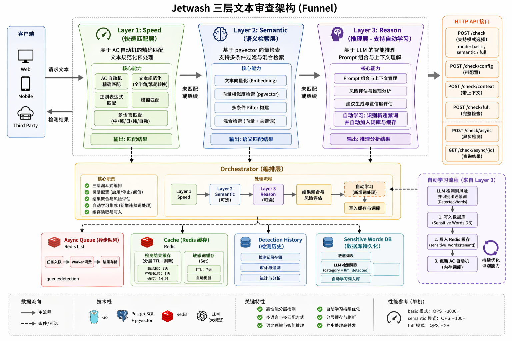

# Jetwash

[](https://golang.org/)
[](LICENSE)

---

A multi-tenant sensitive word filtering and text moderation SaaS platform built with Go, featuring a three-layer funnel architecture for comprehensive text review:

1. **Layer 1: Speed (Fast Matching Layer)** - Exact matching based on AC automaton
2. **Layer 2: Semantic (Semantic Retrieval Layer)** - Vector search based on pgvector
3. **Layer 3: Reason (Reasoning Layer)** - Intelligent reasoning based on LLM

## ✨ Features

### 🏢 Multi-Tenant Data Isolation
- Each tenant has independent API keys
- All sensitive word data is isolated through TenantID
- Tenant status management (active/inactive/suspended)
- Hierarchical tenant structure (up to 5 levels)

### 🔍 Three-Layer Funnel Text Review

#### Layer 1: Fast Matching Layer
- Exact matching based on AC automaton
- Support for regular expression matching
- Support for fuzzy matching
- Multi-language matching support
- Text normalization preprocessing (full/half-width conversion, traditional/simplified conversion)

#### Layer 2: Semantic Retrieval Layer
- Vector similarity calculation using pgvector
- Support for Euclidean distance (`<->`) and cosine distance (`<=>`)
- Configurable similarity threshold and result count
- Support for multiple filter conditions

#### Layer 3: Reasoning Layer
- Intelligent reasoning based on LLM
- **Structured JSON Output**: LLM returns JSON format with automatic fallback to text parsing
- Prompt composition and context management
- Risk assessment and suggestion generation
- Support for both local (Ollama) and cloud LLM providers
- **Auto-learning**: Automatically add detected sensitive words to the database and AC automaton when LLM identifies them (incremental update, < 1ms latency)
- **LLM Observability**: Prometheus metrics (latency, token usage, request counts)

### ⚡ Performance Optimization

#### Redis Cache Layer
- Detection result caching (TTL: 1 hour)
- **Embedding Cache**: Vector embeddings cached for 24 hours, reducing API calls
- Reduce computational overhead for duplicate text
- Support tenant-level cache isolation

#### Async Detection Queue
- Message queue based on Redis List
- Peak shaving and valley filling for high concurrency scenarios
- Blocking dequeue (BRPop) to avoid empty polling
- Task result caching (TTL: 24 hours)

#### Concurrency Optimization
- Concurrent execution of Layer1 and Layer2
- Use goroutine and sync.WaitGroup for concurrency control
- Improve overall detection throughput

#### Performance Testing Tool
- Support concurrent request testing
- Support queue mode testing
- Output key performance metrics (QPS, average latency, P99 latency, etc.)

### 📝 Sensitive Word Management
- CRUD operations for sensitive words
- Enable/disable sensitive words
- Batch import sensitive words (CSV format)
- Paginated query of sensitive word list
- Duplicate detection and automatic skipping

### 📊 Detection History
- Record every text detection result
- Support paginated queries and filtering
- Support time range filtering
- Support deletion and clearing history

### 🔐 Authentication & Authorization
- JWT token authentication
- API key authentication
- Multi-tenant data isolation
- Role-based access control

### 🛡️ Engineering Practices
- **Unified Response Format**: `ecode`-based error codes with consistent API responses
- **Graceful Shutdown**: Context propagation to async workers, channel drain on exit
- **Configurable CORS**: Origin whitelist middleware
- **Tenant-Level Rate Limiting**: Redis-based sliding window (429 + Retry-After)
- **Database Migrations**: Versioned migrations with golang-migrate

## 🛠 Tech Stack

- **Language**: Go 1.25+
- **Web Framework**: Gin
- **ORM**: GORM
- **Database**: PostgreSQL + pgvector
- **Cache**: Redis
- **Configuration**: Viper
- **Authentication**: JWT
- **LLM Support**: Ollama, Online (OpenAI-compatible APIs)
- **Testing**: testify
- **Database Migrations**: golang-migrate
- **Monitoring**: Prometheus + Grafana

## 📁 Project Structure

```
├── cmd/
│   ├── server/              # main.go entry point
│   └── benchmark/           # Performance testing tool
├── internal/
│   ├── cache/               # Redis cache client
│   ├── config/              # Viper configuration definitions
│   ├── metrics/             # Prometheus metrics definitions
│   ├── middleware/          # Gin middleware (JWT auth, CORS, rate limiting)
│   ├── models/              # GORM data models (entities)
│   ├── repository/          # Database operation layer
│   ├── response/            # Unified API response helpers
│   ├── handler/             # Gin route controllers
│   ├── router/              # Route configuration
│   └── service/             # Core business logic layer
│       ├── layer1_speed/    # Layer 1: Fast matching
│       ├── layer2_semantic/ # Layer 2: Semantic retrieval
│       ├── layer3_reason/   # Layer 3: LLM reasoning
│       ├── orchestrator/     # Orchestrator layer
│       ├── queue/           # Async detection queue
│       ├── detection_history/# Detection history service
│       └── api_key/         # API key management
├── migrations/                 # Database migration files (golang-migrate)
├── pkg/
│   ├── benchmark/           # Performance testing tool
│   └── ecode/               # Unified business error codes
├── docs/
│   ├── LAYERED_ARCHITECTURE.md  # Three-layer architecture documentation
│   └── API_DOCUMENTATION.md       # API documentation
├── config.yaml                # Configuration file
├── docker-compose.yml         # Docker orchestration configuration
├── go.mod
└── README.md
```

## 🏗️ Architecture

<div align="center">
  
</div>

## 🚀 Quick Start

### Option 1: Docker Deployment (Recommended)

#### 1. Start All Services

```bash
# Start PostgreSQL, Redis, Ollama services
docker-compose up -d

# Check service status
docker-compose ps
```

#### 2. Install Ollama Models

```bash
# Enter Ollama container
docker exec -it jetwash-ollama bash

# Install reasoning model
ollama pull qwen2.5:0.5b

# Install embedding model
ollama pull nomic-embed-text:v1.5

# Exit container
exit
```

#### 3. Configure Application

Edit `config.yaml` file:

```yaml
server:
  port: 13142
  mode: debug
  read_timeout: 300
  write_timeout: 300

database:
  host: localhost
  port: 15432
  user: postgres
  password: jetwash-postgres
  dbname: jetwash
  sslmode: disable
  max_open_conns: 100
  max_idle_conns: 10

redis:
  addr: "localhost:16379"
  password: "jetwash-redis"
  db: 0

llm:
  ollama:
    host: "http://localhost"
    port: 11434
    embedding_model: "nomic-embed-text:v1.5"
    reasoning_model: "qwen2.5:0.5b"
  online:
    api_key: "your-api-key"
    model: "glm-4.7"
    base_url: "https://open.bigmodel.cn/api/paas/v4"
    embedding_model: "embedding-3"
  provider: "ollama"  # online, ollama

jwt:
  secret: "jetwash-jwt-secret"
  expire_hour: 24

cors:
  allowed_origins: ["*"]

rate_limit:
  enabled: true
  requests_per_minute: 60
```

#### 4. Run Database Migrations

```bash
# Install golang-migrate CLI
go install -tags 'postgres' github.com/golang-migrate/migrate/v4/cmd/migrate@latest

# Run migrations
make migrate-up

# Rollback migrations
make migrate-down

# Create new migration
make migrate-create
```

#### 5. Run Application

```bash
# Download dependencies
go mod tidy

# Run service
go run cmd/server/main.go

# Or build and run
go build -o bin/jetwash cmd/server/main.go
./bin/jetwash
```

### Option 2: Manual Deployment

#### 1. Prerequisites

Ensure you have installed:

- Go 1.25+
- PostgreSQL 14+ (with pgvector extension)
- Redis 7+

#### 2. Install pgvector Extension

```sql
-- Connect to PostgreSQL
psql -U postgres

-- Create database
CREATE DATABASE jetwash;

-- Connect to database
\c jetwash

-- Install pgvector extension
CREATE EXTENSION IF NOT EXISTS vector;
```

#### 3. Configure Redis

```bash
# Start Redis (with password)
redis-server --requirepass your-redis-password
```

#### 4. Configure Application

Edit `config.yaml` file, configure database and Redis connection information.

#### 5. Run Service

```bash
# Download dependencies
go mod tidy

# Run service
go run cmd/server/main.go
```

## 📚 Documentation

- [Three-Layer Architecture Documentation](./docs/LAYERED_ARCHITECTURE.md)
- [API Documentation](./docs/API_DOCUMENTATION.md)
- [Code Optimization Documentation](./docs/optimization/CODE_OPTIMIZATION.md)
- [AC Automaton Update Strategies](./docs/optimization/AC_AUTOMATON_UPDATE_STRATEGIES.md)
- [Technical Decisions](./docs/technical-decisions/THREE_LAYER_ARCHITECTURE.md)

## 📋 TODO / Roadmap

### 🎯 High Priority

- [ ] **Voice Content Moderation** - Add speech-to-text conversion and sensitive content detection for audio files
- [ ] **Video Content Moderation** - Extract frames and audio from videos, detect sensitive visual content and speech
- [ ] **Image Content Moderation** - Integrate image recognition to detect sensitive images, logos, and inappropriate content
- [ ] **Real-time Streaming Moderation** - Support WebSocket-based real-time text/audio streaming detection

### ⚡ Performance Enhancements

- [ ] **Distributed Cache** - Support Redis Cluster for high availability and horizontal scaling
- [ ] **Load Balancing** - Add support for multiple backend instances with load balancing
- [x] **Rate Limiting per Tenant** - Implement tenant-level rate limiting to prevent abuse ✅ Implemented
- [ ] **Connection Pool Optimization** - Fine-tune database and Redis connection pool settings

### 🔧 Feature Enhancements

- [x] **Incremental AC Automaton Update** - Auto-learning with incremental update, new words take effect in < 1ms ✅ Implemented
- [ ] **Blacklist/Whitelist** - Support tenant-specific blacklist and whitelist rules
- [ ] **Real-time Alerting** - Send webhook notifications when sensitive content is detected
- [ ] **Audit Log** - Comprehensive audit logging for all sensitive operations
- [ ] **API Analytics** - Dashboard for API usage statistics and detection trends per tenant
- [ ] **Batch Detection API** - Support batch text detection in a single request
- [ ] **Language Detection** - Auto-detect text language and apply appropriate rules

### 🔐 Security Improvements

- [ ] **Data Encryption** - Encrypt sensitive data at rest and in transit
- [ ] **Access Logging** - Detailed logging of API access and operations
- [ ] **IP Whitelisting** - Allow tenants to restrict API access to specific IP ranges
- [ ] **API Key Rotation** - Support automatic API key rotation and management

### 🧪 Testing & Quality

- [x] **Unit Tests** - Core service layer unit tests (Layer1, Layer3, Orchestrator, Queue, Response) ✅ Implemented
- [ ] **Integration Tests** - End-to-end integration testing
- [ ] **CI/CD Pipeline** - Automated testing and deployment pipeline
- [ ] **Performance Benchmark Suite** - Regular performance regression testing

### 📈 Monitoring & Observability

- [x] **Prometheus Metrics** - LLM call latency, token usage, request counts, `/metrics` endpoint ✅ Implemented
- [ ] **Grafana Dashboard** - Visual dashboard for real-time monitoring
- [ ] **Distributed Tracing** - Support OpenTelemetry for distributed tracing
- [ ] **Health Check API** - Add health check endpoints for all services

## 🧪 Performance Testing

### Warmup Mechanism

The system includes a warmup mechanism that preloads critical components on startup to optimize first-request performance:

- **Layer1 AC Automaton**: Preloads sensitive words for specified tenants (builds AC automaton in memory)
- **Layer3 LLM Model**: Sends a test request to load the Ollama model into memory
- **Benefit**: Reduces first-request latency from seconds to milliseconds

### Benchmark Tools

We provide three benchmark tools to test different scenarios:

#### 1. `benchmark` - Original Performance Test Tool

Supports random text generation, queue mode, and different detection modes.

```bash
# Build all benchmark tools
go build -o bin/benchmark cmd/benchmark/main.go

# Random text test (mixed sensitive words)
./bin/benchmark -random -total 100 -concurrent 5 \
  -tenant a8102056-2b5d-4d92-b5e8-083bd96ec523

# Test with specific mode
./bin/benchmark -mode semantic -total 100 -concurrent 5

# Queue mode test
./bin/benchmark -queue -total 1000

# Custom config file
./bin/benchmark -config custom-config.yaml
```

#### 2. `benchmark_normal` - Non-Sensitive Word Test

Tests the fast-pass path (Layer1 quick release), no LLM calls.

```bash
# Build and run
go build -o bin/benchmark_normal cmd/benchmark_normal/main.go
./bin/benchmark_normal -total 1000 -concurrent 100

# Expected performance: QPS 1500+, latency < 1ms
```

#### 3. `benchmark_fix` - Mixed Text Test (Configurable Ratio)

Simulates real-world traffic with configurable sensitive word ratio.

```bash
# Build and run
go build -o bin/benchmark_fix cmd/benchmark_fix/main.go

# 30% sensitive words + 70% normal words
./bin/benchmark_fix -total 100 -concurrent 5 -ratio 0.3 \
  -tenant a8102056-2b5d-4d92-b5e8-083bd96ec523

# 10% sensitive words (closer to real-world scenario)
./bin/benchmark_fix -total 200 -concurrent 5 -ratio 0.1 \
  -tenant a8102056-2b5d-4d92-b5e8-083bd96ec523
```

### Benchmark Parameters

| Parameter | Description | Default |
|-----------|-------------|---------|
| `-total` | Total requests | 1000 |
| `-concurrent` | Concurrent requests | 100 |
| `-ratio` | Sensitive word ratio (0-1) | 0.1 (10%) |
| `-tenant` | Specify tenant ID | Auto-generated |
| `-random` | Generate random text | false |
| `-mode` | Detection mode (full/basic/semantic) | full |
| `-unique` | Add unique suffix | true |
| `-queue` | Queue mode test | false |

### Performance Comparison

| Tool | Scenario | Expected QPS | LLM Calls |
|------|----------|--------------|-----------|
| benchmark_normal | 100% normal text | 1500+ | 0% |
| benchmark_fix (10%) | 10% sensitive words | 50-100 | 5-10% |
| benchmark_fix (30%) | 30% sensitive words | 20-50 | 15-20% |
| benchmark (full) | Mixed with LLM | < 5 | Depends on content |

### Performance Metrics

- **QPS (Queries Per Second)**: Number of requests processed per second
- **Average Latency**: Average response time for all requests
- **P50/P95/P99 Latency**: Response time for 50%/95%/99% of requests
- **Cache Hit Rate**: Percentage of requests served from cache
- **Layer Distribution**: Statistics on which layers were triggered
- **Success Rate**: Percentage of successful requests
- **Total Duration**: Total time to complete all requests

## 🤝 Contributing

Contributions are welcome! Please feel free to submit a Pull Request.

1. Fork the repository
2. Create your feature branch (`git checkout -b feature/AmazingFeature`)
3. Commit your changes (`git commit -m 'Add some AmazingFeature'`)
4. Push to the branch (`git push origin feature/AmazingFeature`)
5. Open a Pull Request

## 📄 License

This project is licensed under the MIT License - see the [LICENSE](LICENSE) file for details.

## 🙏 Acknowledgments

- [Gin](https://gin-gonic.com/) - HTTP web framework
- [GORM](https://gorm.io/) - ORM library
- [pgvector](https://github.com/pgvector/pgvector) - Vector similarity search for PostgreSQL
- [Redis](https://redis.io/) - In-memory data store and cache
- [Ollama](https://ollama.com/) - Local LLM service
- [Viper](https://github.com/spf13/viper) - Configuration management

---

<div align="center">
  
</div>

<div align="center">
  <sub>Built with ❤️ by Wenhao</sub>
</div>
